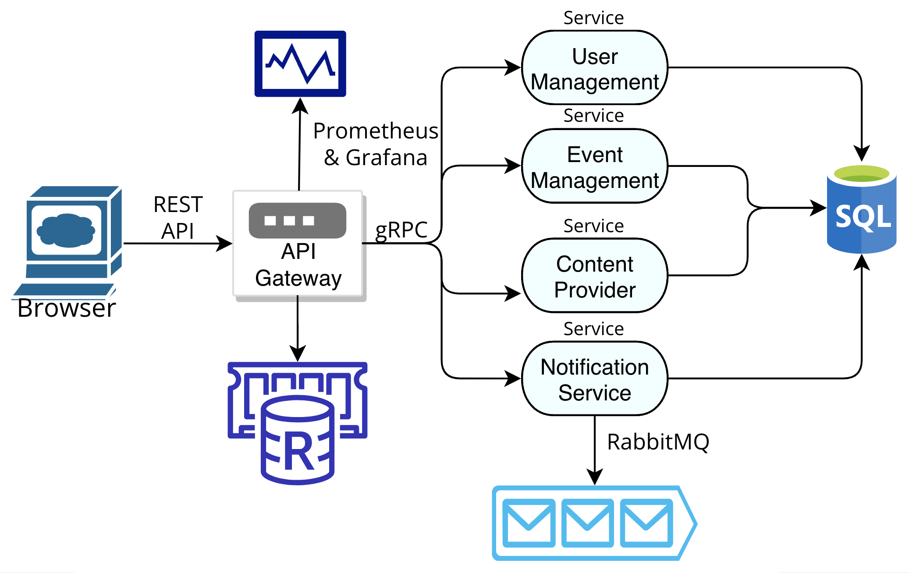

# FAF Hub Backend

The backend of the FAF Community Web Application is designed to support a dynamic and interactive platform for the Faculty of Computers, Informatics, and Microelectronics at the Technical University of Moldova. This backend architecture is crafted using a microservices approach, enabling scalable, flexible, and robust application management.


-----------
[How to run the application?](#how-to-run-the-application-1)
-----------


#### Gateway

- Serves as the main entry point for all communications, routing requests to the appropriate services within the backend. It ensures efficient load balancing and security checks.
    
#### Services

- **User Service**: Manages all user-related functionalities including authentication, profile management.
- **Event Service**: Handles event creation, management, registration, providing tools for event organizers and participants.
- **Content Provider Service**: Manages the delivery and organization of content, ensuring that users have access to relevant and timely educational and community information.
- **Notification Service**: Sends out notifications through emails to users, supporting real-time newsletter on events, and user verification.
    

Each service is designed to operate independently, communicating over well-defined APIs using HTTP protocols to ensure seamless integration and reliable data exchange. This structure not only enhances the application's responsiveness and maintenance but also supports continuous integration of feedback and agile updates, crucial for the evolving needs of the FAF community.

### Architecture



### Endpoints

#### Register user: POST
Registers a user in the application. Needs email and password.
>```
>http://127.0.0.1:5050/user/register
>```
##### Body (**json**)

```json
{
    "email": "email@mail.com",
    "password": "test"
}
```

#### Login user: POST
Logs an existing user in the application. Needs email and password.
>```
>http://127.0.0.1:5050/user/login
>```
##### Body (**json**)

```json
{
    "email": "email@mail.com",
    "password": "test"
}
```

#### Google user authentication: GET
Logs an existing user in the application. Needs email and password.
>```
>http://127.0.0.1:5050/user/google_auth
>```

#### Get user info: GET
Retrieves user information (email, phone number, first/last name, and academic group). The user must be logged in.
>```
>http://127.0.0.1:5050/user
>```

#### Update user info: POST
Updates user information. Needs at least one of the columns. The user must be logged in and verified.
>```
>http://127.0.0.1:5050/user/update
>```
##### Body (**json**)

```json
{
    "email": "email2@mail.com",
    "first_name": "Test",
    "last_name": "Test",
    "academic_group": "FAF-XXX"
}
```

#### Logout user: GET
Logs out the user from the application.
>```
>http://127.0.0.1:5050/user/logout
>```

#### Subscribe to newsletter: GET
Subscribes to newsletter about new events in the application. The user must be logged in and verified.
>```
>http://127.0.0.1:5050/user/subscribe
>```

#### Unsubscribe from newsletter: GET
Unsubscribes from newsletter about new events in the application. The user must be logged in and verified.
>```
>http://127.0.0.1:5050/user/usubscribe
>```

#### Send user verification email: GET
Sends an email containing a passcode which is valid for 10 minutes to further verify the user. The user must be logged in.
>```
>http://127.0.0.1:5050/user/send-verification
>```

#### Complete user verification: POST
Completes the user verification process by validating the passcode. The user must be logged in.
>```
>http://127.0.0.1:5050/user/complete-verification
>```
##### Body (**json**)

```json
{
  "passcode": "000000"
}
```

#### Create event: POST
Posts an event to the application. The user must be an admin, logged in and verified. The `"cover"` can be a base64 encoded string or an image link.
>```
>http://127.0.0.1:5050/event/create
>```
##### Body (**json**)

```json
{
    "name": "Event",
    "start": "2024-06-20T10:30:00Z",
    "end": "2024-06-20T12:00:00Z",
    "location": "Event Location",
    "deadline": "2024-06-15T00:00:00Z",
    "cover": "base64",
    "desc": "Event Description"
}
```

#### Edit event: POST
Updates an existing event in the application. The user must be an admin, logged in and verified. Needs at least one of the columns and the event id. The `"cover"` can be a base64 encoded string or an image link.
>```
>http://127.0.0.1:5050/event/edit
>```
##### Body (**json**)

```json
{
    "event_id": 1,
    "event": {
        "name": "Name",
        "start": "2024-06-20T10:30:00Z",
        "end": "2024-06-20T12:00:00Z",
        "location": "Event Location",
        "deadline": "2024-06-15T00:00:00Z",
        "cover": "base64",
        "desc": "Event Description 2"
    }
}
```

#### Delete event: DELETE
Deletes an existing event in the application. The user must be an admin, logged in and verified. The event id is a parameter in the URL.
>```
>http://127.0.0.1:5050/event/delete/1
>```

#### Get event info: GET
Retrieves information about an existing event in the application. The event id is a parameter in the URL.
>```
>http://127.0.0.1:5050/event/1
>```

#### Get all events info: GET
Retrieves all existing events and the information about them in the application.
>```
>http://127.0.0.1:5050/event/all
>```

#### Register for event: POST
Registers an existing user for an existing event in the application. The user must be logged in, verified, and not an admin. The event id is a parameter in the URL. The `"phone_number"` may not begin with 0.
>```
>http://127.0.0.1:5050/event/register/1
>```
##### Body (**json**)

```json
{
    "first_name": "Test",
    "last_name": "Test",
    "email": "email@mail.com",
    "phone_number": 88888888,
    "academic_group": "FAF-XXX",
    "team_members": "none",
    "shirt_size": "M",
    "food_pref": "none",
    "motivation": "I love FAF events",
    "questions": "none"
}
```

#### Get registrations for an event: GET
Retrieves all registrations for an existing event in the application. The user must be logged in, verified, and an admin. The event id is a parameter in the URL.
>```
>http://127.0.0.1:5050/event/registrations/1
>```

#### Get user registration for an event: GET
Retrieves a user's registration for an existing event. The user must be logged in and not an admin. The event id is a parameter in the URL.
>```
>http://127.0.0.1:5050/event/1/registration
>```

#### Get events user registered for: GET
Retrieves events a user registered for. The user must be logged in and not an admin.
>```
>http://127.0.0.1:5050/event/registered
>```

#### Edit event registration by user: POST
Updates an existing registration for an existing event in the application. The user must be logged in and not an admin. Needs at least one of the columns and the `"event_id"`. The `"phone_number"` may not begin with 0.
>```
>http://127.0.0.1:5050/event/registration/edit
>```
##### Body (**json**)

```json
{
    "event_id": 1,
    "first_name": "Test1",
    "last_name": "Test1",
    "email": "email2@mail.com",
    "phone_number": 22222222,
    "academic_group": "FAF-XXX",
    "team_members": "none",
    "shirt_size": "M",
    "food_pref": "none",
    "motivation": "I love FAF events",
    "questions": "none"
}
```

#### Post event feedback: POST
Saves user feedback about an existing event. The user must be logged in and not an admin.
>```
>http://127.0.0.1:5050/event/feedback
>```
##### Body (**json**)

```json
{
    "event_id": 1,
    "feedback": "loved it"
}
```

#### Post article/project: POST
Posts an article or a project to the application. The user must be logged in, verified, and an admin. The accepting content types are `"article"` and `"project"`. The `"cover"` and `"images"` can be base64 encoded strings or image links.
>```
>http://127.0.0.1:5050/content/post
>```
##### Body (**json**)

```json
{
    "type": "article",
    "name": "Test",
    "authors": "Test Test",
    "cover": "base64",
    "text": "abc abc abc",
    "images": "base64, base64, base64"
}
```

#### Edit article/project: POST
Updates an existing article or projects in the application. The user must be logged in, verified, and an admin. Needs at least one of the columns. The `"cover"` and `"images"` can be base64 encoded strings or image links.
>```
>http://127.0.0.1:5050/content/edit
>```
##### Body (**json**)

```json
{
    "content_id": 1,
    "content": {
        "name": "Test1",
        "authors": "Test1 Test1",
        "cover": "base64",
        "text": "abc abc abc",
        "images": "base64"
    }
}
```

#### Delete content: DELETE
Deletes an article/project from the application. The user must be logged in, verified, and an admin. The content id is a parameter in the URL.
>```
>http://127.0.0.1:5050/content/delete/1
>```

#### Get article/project: GET
Retrieves an existing article or a project in the application. The content id is a parameter in the URL.
>```
>http://127.0.0.1:5050/content/1
>```

#### Get articles: GET
Retrieves all existing articles and their information in the application.
>```
>http://127.0.0.1:5050/content/articles
>```

#### Get projects: GET
Retrieves all existing projects and their information in the application.
>```
>http://127.0.0.1:5050/content/projects
>```


-----------
## How to run the application?
1. Install Docker;
2. Use the docker compose file to build the app;
3. Allow 30-45 seconds before making any requests.